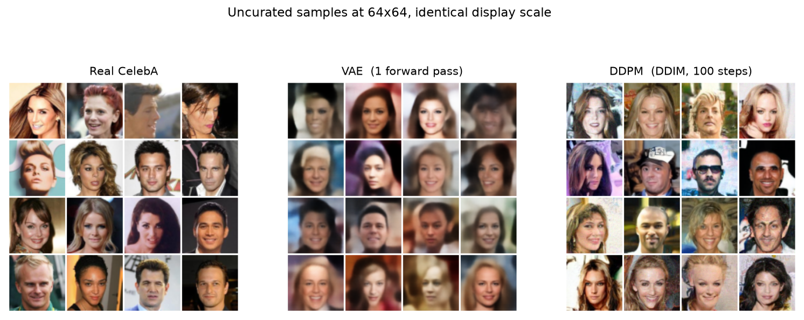
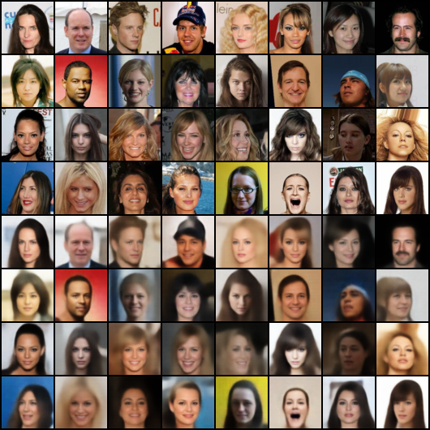
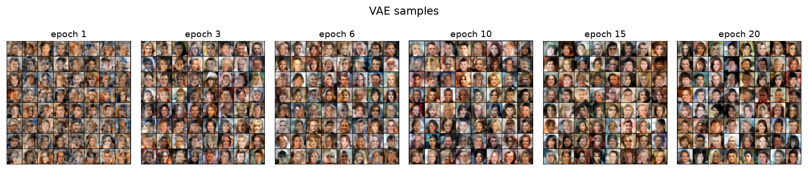
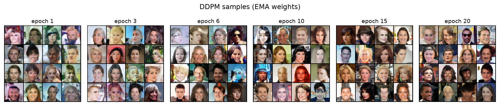
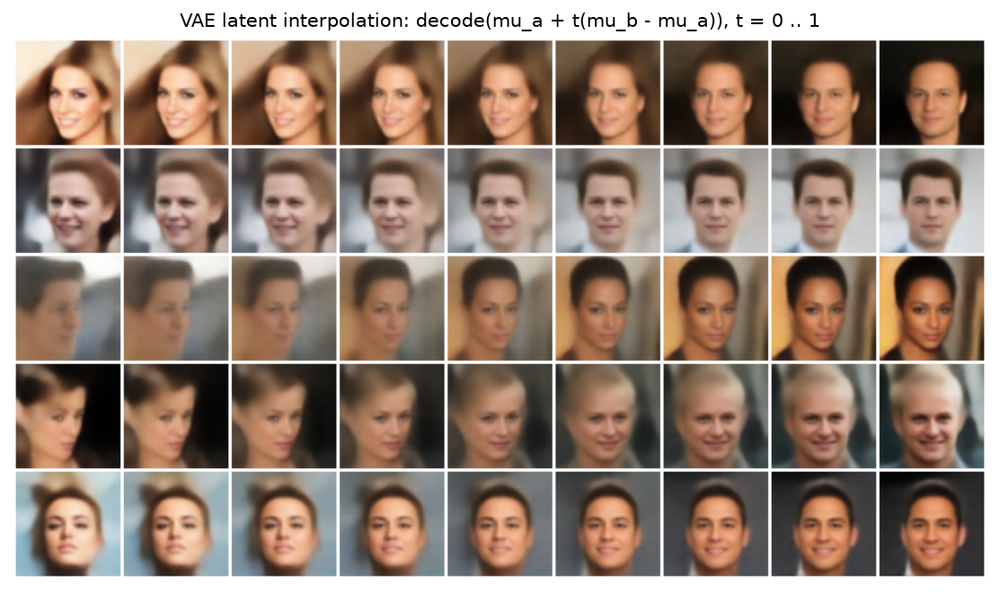
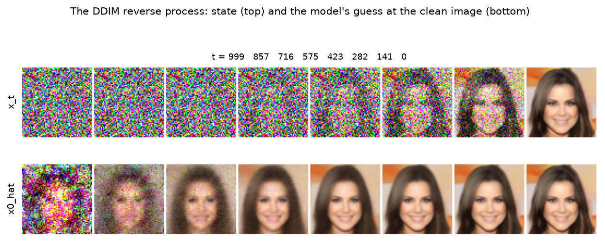
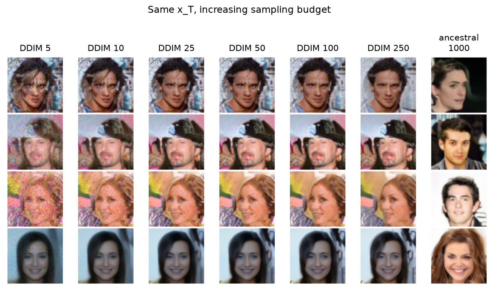
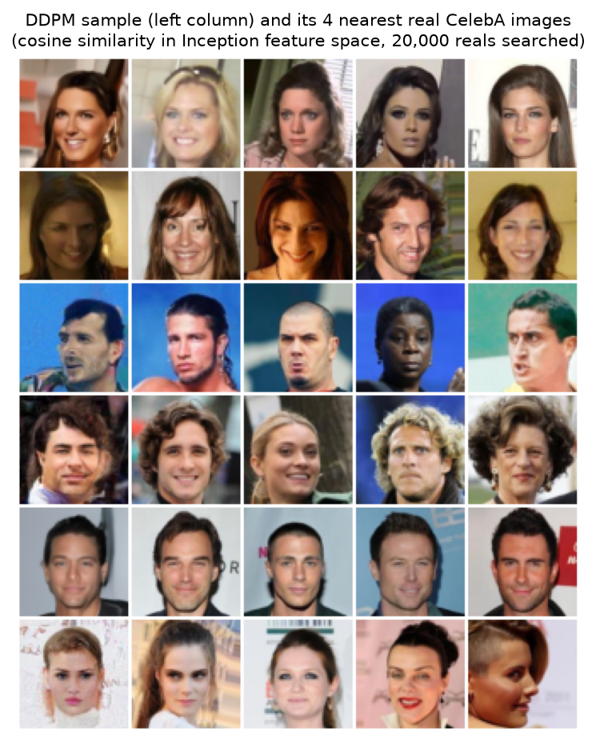
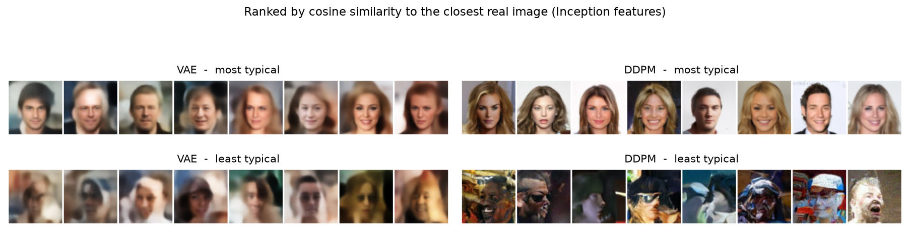

# A VAE and a DDPM on CelebA, built from scratch

Two generative models of 64x64 face images, implemented from primitive PyTorch
layers and compared on the same data with the same metrics.

---

## 1. Task and setup

Learn a distribution over CelebA faces and sample from it, two ways:

- a **VAE**, which compresses an image to a short code and decodes codes back
  into images;
- a **DDPM**, which learns to reverse a process that turns an image into noise.

Both train on the same 202,599 aligned CelebA images at 64x64 and are scored
with the same FID/IS pipeline.

### Preprocessing

CelebA's aligned images are 178x218, the extra height being background above and
below the face. So: crop the central 178x178 square, resize to 64x64, mirror
horizontally at random (training only — faces are roughly symmetric), and scale
pixels to **[-1, 1]**.

The [-1, 1] range matters to both models. The VAE decoder ends in `tanh`, so
data and output space match by construction. The DDPM mixes the image with
standard Gaussian noise and needs roughly zero mean and unit variance; data in
[0, 1] has mean 0.5, and that offset shows up as a colour cast.


---

## 2. The VAE

### 2.1 Assumptions

A VAE assumes each image came from a two-step process:

1. draw a latent code &nbsp; **z ~ N(0, I)** &nbsp; — 128 numbers here
2. decode it &nbsp; **x ~ p<sub>θ</sub>(x | z)**

Training the decoder needs `p(z | x)`, which is intractable, so a second network
approximates it:

&nbsp;&nbsp;&nbsp;&nbsp;**q<sub>φ</sub>(z | x) = N( μ(x), diag(σ(x)²) )**

The encoder outputs `μ` and **log σ²**, not `σ`: a log is unconstrained, and
`exp()` turns any real number into a positive variance.

### 2.2 The loss

`log p(x)` is intractable, but the ELBO bounds it:

&nbsp;&nbsp;&nbsp;&nbsp;**log p(x) ≥ E<sub>z~q</sub>[ log p(x|z) ] − KL( q(z|x) ‖ p(z) )**

Negating gives **loss = reconstruction error + KL**.

**Reconstruction.** Squared error summed over all 3·64·64 = 12,288 pixels, then
averaged over the batch — the negative log-likelihood of a fixed-variance
Gaussian decoder, constants dropped.

The summing matters. The ELBO adds a *per-image* reconstruction term to a
*per-image* KL. Averaging over pixels instead shrinks reconstruction by 12,288x,
the KL dominates, and the model collapses to the dataset mean — the usual cause
of a VAE that emits a grey blob. `test_recon_is_summed_over_pixels` guards this.

**KL.** Both distributions are diagonal Gaussians, so no sampling is needed.
Per dimension:

&nbsp;&nbsp;&nbsp;&nbsp;**KL = ½ ( σ² + μ² − 1 − log σ² )**

`μ²` punishes means away from zero; `σ² − 1 − log σ²` punishes variances away
from one. It is zero exactly when the posterior equals the prior.

Without the KL term this is an ordinary autoencoder: codes scatter anywhere, and
`z ~ N(0, I)` at generation time lands in regions the decoder never saw. The KL
is what makes the prior a valid place to sample from.

### 2.3 Reparameterisation

Sampling is not differentiable, so `z` is rewritten as a deterministic function
of the parameters plus parameter-independent noise:

&nbsp;&nbsp;&nbsp;&nbsp;**z = μ + σ · ε,&nbsp;&nbsp; ε ~ N(0, I)**

Now `dz/dμ = 1` and `dz/dσ = ε`, so gradients reach the encoder.

### 2.4 Architecture

| | |
|---|---|
| Encoder | 4 stages of `Conv(k=4, s=2, p=1) → BatchNorm → LeakyReLU(0.2)`, widths 64 → 128 → 256 → 512, so 64x64 → 4x4. Then two `Linear` heads produce `μ` and `log σ²`. |
| Decoder | `Linear` to 512x4x4, then 4 stages of `ConvTranspose(k=4, s=2, p=1) → BatchNorm → ReLU`, then a 3x3 conv and `tanh`. |
| Size | 8.73M parameters at latent dimension 128 — 4.86M encoder, 3.88M decoder |

- `k=4, s=2, p=1` maps H to exactly H/2 (and its transpose to 2H) for even H.
- LeakyReLU in the encoder keeps a gradient for negative inputs.
- The final 3x3 conv cleans up transposed-convolution checkerboard artefacts.
- BatchNorm is fine here, unlike in the DDPM, because the VAE always runs with a
  reasonable batch size.

### 2.5 Why VAE samples are blurry

Per-pixel squared error is the log-likelihood of a Gaussian decoder. Under that
assumption, when several plausible images fit a code equally well, the loss is
minimised by their **average** rather than by any one of them. The average of
many sharp faces is a smooth face.

This follows from the objective, so no amount of training fixes it. It is the
main axis on which the diffusion model wins.

---

## 3. The DDPM

### 3.1 Assumptions

A fixed **forward process** adds a little Gaussian noise at each of T = 1000
steps:

&nbsp;&nbsp;&nbsp;&nbsp;**q(x<sub>t</sub> | x<sub>t−1</sub>) = N( √(1 − β<sub>t</sub>) · x<sub>t−1</sub>, β<sub>t</sub> I )**

`β_t` grows with t, spaced linearly from 1e-4 to 0.02. After 1000 steps the
image is indistinguishable from noise. A network learns to undo one step at a
time; generation starts from noise and runs backwards.

### 3.2 The closed form

Composing t Gaussian steps gives another Gaussian:

&nbsp;&nbsp;&nbsp;&nbsp;**q(x<sub>t</sub> | x<sub>0</sub>) = N( √ᾱ<sub>t</sub> · x<sub>0</sub>, (1 − ᾱ<sub>t</sub>) I )**

where **α<sub>t</sub> = 1 − β<sub>t</sub>** and **ᾱ<sub>t</sub> = ∏<sub>s≤t</sub> α<sub>s</sub>**. In code:

&nbsp;&nbsp;&nbsp;&nbsp;**x<sub>t</sub> = √ᾱ<sub>t</sub> · x<sub>0</sub> + √(1 − ᾱ<sub>t</sub>) · ε**

Training on timestep 700 therefore costs one multiply-add, not 700 simulated
steps. This is why DDPM training is cheap and parallel while sampling is
expensive and sequential.

The two coefficients satisfy **a² + b² = 1**, keeping the variance of `x_t` at 1
throughout provided the data has unit variance — hence the [-1, 1] scaling.
`test_variance_preserved` asserts this at every timestep.

The schedule constants are computed in **float64** and cast down at the end.
`ᾱ_t` is a cumulative product of 1000 terms spanning many orders of magnitude
(`ᾱ_999 ≈ 4e-5`), and float32 rounding there is visible in the samples.

### 3.3 Objective

The full variational bound simplifies (Ho et al. 2020, eq. 14) to a regression:
given a noisy image, predict the noise that was added.

&nbsp;&nbsp;&nbsp;&nbsp;**L = E<sub>x₀, t, ε</sub> ‖ ε − ε<sub>θ</sub>(x<sub>t</sub>, t) ‖²**

One term, no adversarial game, no learned posterior — the main structural
difference from the VAE, and why diffusion models train more reliably than GANs.


### 3.4 The network

A U-Net predicting `ε`. Three properties make it the standard choice: input and
output share a shape; skip connections carry high-frequency detail around the
bottleneck (noise is entirely high-frequency, so a plain autoencoder would
destroy exactly what the network must predict); and the timestep is easy to
inject into every block.

Shapes at base 64 with multipliers (1, 2, 2, 4):

```
input    3 x 64 x 64
stem    64 x 64 x 64
level 0  64 x 64 x 64  -> down ->  64 x 32 x 32
level 1 128 x 32 x 32  -> down -> 128 x 16 x 16
level 2 128 x 16 x 16  + attention  -> down -> 128 x 8 x 8
level 3 256 x  8 x  8
middle  256 x  8 x  8  (res -> attention -> res)
... mirrored upward, concatenating the matching skip at every block ...
output   3 x 64 x 64
```

**Timestep embedding.** A raw scalar `t` gives a convolution nothing to build
features from, so we use the Transformer positional encoding:

&nbsp;&nbsp;&nbsp;&nbsp;**emb(t)[i] = sin( t / 10000<sup>i/half</sup> ),&nbsp;&nbsp; emb(t)[half+i] = cos( t / 10000<sup>i/half</sup> )**

Low-index entries oscillate quickly and separate neighbouring timesteps;
high-index entries encode coarse position. It has no parameters; a small MLP
afterwards learns which frequencies matter. The result is added into every
residual block as a per-channel bias, so one set of weights behaves differently
at different noise levels.

**Self-attention at 16x16 and below.** Convolutions see only a local
neighbourhood, so nothing forces distant parts of the image to agree. Attention
is what keeps a face symmetric and its two eyes matching. The attention matrix
is (H·W)², so cost grows with the fourth power of the side length — affordable
only at low resolution.

**GroupNorm, not BatchNorm.** Sampling often runs with very small batches, where
BatchNorm statistics become unreliable. GroupNorm normalises within a single
sample. One caveat: a group holding exactly one channel degenerates into
InstanceNorm and cancels the timestep bias added just before it, so the group
count is capped at `channels // 2`.

**Zero-initialised output convolutions.** `ResBlock.conv2`, the attention
projection and the final head start at zero, making every residual block the
identity at step 0. Deep residual stacks train more stably from there.

### 3.5 Sampling

**Ancestral (DDPM), T steps.** Each step: predict the noise; convert it to an
estimate of `x₀`; clamp to [-1, 1]; compute the posterior mean and variance;
draw from it.

&nbsp;&nbsp;&nbsp;&nbsp;**x̂<sub>0</sub> = ( x<sub>t</sub> − √(1 − ᾱ<sub>t</sub>) · ε<sub>θ</sub> ) / √ᾱ<sub>t</sub>**

&nbsp;&nbsp;&nbsp;&nbsp;**μ = coef1 · x̂<sub>0</sub> + coef2 · x<sub>t</sub>**, &nbsp;&nbsp; **coef1 = β<sub>t</sub>√ᾱ<sub>t−1</sub>/(1−ᾱ<sub>t</sub>)**, &nbsp;&nbsp; **coef2 = (1−ᾱ<sub>t−1</sub>)√α<sub>t</sub>/(1−ᾱ<sub>t</sub>)**

At `t = 0` we return the mean rather than sampling, since adding noise to the
finished image only makes it grainy. The clamp is a cheap and effective
stabiliser: early steps can otherwise predict wildly out-of-range images that
then amplify.

The coefficients satisfy an exact identity: substitute the noise-free
`x_t = √ᾱ_t · x₀` and the expression collapses to `√ᾱ_{t−1} · x₀`.
`test_posterior_mean_identity` asserts it.

**DDIM, 50 steps.** The objective only constrains the marginals `q(x_t | x₀)`,
and many reverse processes share them — including a deterministic one that can
skip timesteps:

&nbsp;&nbsp;&nbsp;&nbsp;**x<sub>prev</sub> = √ᾱ<sub>prev</sub> · x̂<sub>0</sub> + √(1 − ᾱ<sub>prev</sub> − σ²) · ε + σ · noise**

&nbsp;&nbsp;&nbsp;&nbsp;**σ = η · √((1−ᾱ<sub>prev</sub>)/(1−ᾱ<sub>t</sub>)) · √(1 − ᾱ<sub>t</sub>/ᾱ<sub>prev</sub>)**

`η = 0` zeroes σ, so the process is deterministic and the same starting noise
always gives the same image; `η = 1` recovers the stochastic update. 50 steps
instead of 1000 is a **20x speedup** for a small quality cost, and is what makes
scoring 10,000 images practical.

### 3.6 Weight EMA

Diffusion sample quality is unusually sensitive to weight noise — the final SGD
iterate gives visibly worse images than an average of recent iterates. So we
sample from a smoothed copy:

&nbsp;&nbsp;&nbsp;&nbsp;**shadow ← decay · shadow + (1 − decay) · current**

**The warm-up is not optional.** The shadow starts as a copy of the *random
initialisation*, and with a fixed decay of 0.9999 the fraction still present
after N updates is `0.9999^N`:

| updates | fraction of the shadow that is still random init |
|---|---|
| 1,000 | 90% |
| 11,000 | 33% |
| 30,000 | 5% |

A network is not a linear function of its weights, so a third of a random
initialisation does not blur the output, it destroys it. The fix, used by ADM,
`timm` and the Karras codebase, ramps the decay in from near zero:

&nbsp;&nbsp;&nbsp;&nbsp;**effective_decay = min( decay, (1 + step) / (10 + step) )**

At step 0 that is 0.1, so real weights dominate immediately and the residual
initialisation falls off as N⁻⁹. Skipping the ramp is not hypothetical: with a
fixed 0.9999 over a short run it produces a model whose training loss and
gradient norms look perfectly healthy while its samples are grey mush, because
training never reads the shadow weights.

---

## 4. Evaluation

### FID (lower is better)

Summarise each image collection as one 2048-dimensional Gaussian over
InceptionV3 pool features, then measure the distance between them:

&nbsp;&nbsp;&nbsp;&nbsp;**d² = ‖μ₁ − μ₂‖² + Tr( Σ₁ + Σ₂ − 2(Σ₁Σ₂)<sup>½</sup> )**

The first term is how far apart the two "average images" sit in feature space;
the second is how differently the collections are spread out. FID therefore
responds to **both realism and diversity** — a model producing one perfect face
every time scores terribly, because its covariance collapses.

Two practical points:

- `(Σ₁Σ₂)^½` is a *matrix* square root. The product of two symmetric
  positive-definite matrices need not be symmetric, so it needs a general
  `sqrtm` with a small imaginary component discarded afterwards.
- A 2048x2048 covariance estimated from fewer than 2048 samples is singular, and
  the result is dominated by estimation noise. **10,000 images is the minimum
  worth quoting**; the code warns below the feature dimension.

### Inception Score (higher is better)

&nbsp;&nbsp;&nbsp;&nbsp;**IS = exp( E<sub>x</sub>[ KL( p(y|x) ‖ p(y) ) ] )**

`p(y|x)` is the classifier's output for one image, peaked if the image is
recognisable; `p(y)` is the average over all images, near uniform if the
collection is varied. Their KL is large exactly when samples are confident *and*
diverse. The bounds are exact and testable: a collapsed set scores 1.0, and a
set spread evenly over K confidently-classified classes scores K.

IS uses no labels of any kind — `p(y|x)` comes from pixels through a frozen
classifier and `p(y)` is their average. This is why `list_attr_celeba.txt` is
never opened in this project; CelebA's 40 attributes would only matter for
*conditional* generation. IS is also reference-free: it never looks at the real
images either.

**IS is weak on faces.** Running Inception over 500 real CelebA images:

| count | ImageNet class |
|---|---|
| 83 / 500 | Windsor tie |
| 65 / 500 | maillot (tank suit) |
| 35 / 500 | jersey |
| 33 / 500 | brassiere |
| 30 / 500 | oboe |
| 24 / 500 | tench *(a fish)* |

Only **67 of the 1000 classes** are used at all, at a mean top-class confidence
of **0.254**. ImageNet has no "face" category, so the network latches onto
clothing and necklines; "tench" appears because ImageNet's tench photographs are
mostly people holding a fish. So IS here measures "does a network never trained
on faces produce a confident and varied guess?", not "are these varied,
recognisable faces?"

**Real CelebA images score IS = 3.07 ± 0.09** over the same 10,000 images the
models are scored against. That is the ceiling; a generator scoring 3.0 is not
near-perfect, it merely confuses Inception the way real faces do.

Sample size should always be quoted with the score: the same pipeline over 500
real images gives 2.95 ± 0.14. IS is a ratio of entropies estimated from the
sample and both estimates are biased at small N, so IS values are only
comparable at equal N. FID has no equivalent problem, since it compares feature
*distributions* rather than relying on class semantics.

**On published numbers:** papers use the original TensorFlow Inception graph,
whose weights differ slightly from torchvision's port, so absolute values here
are close to but not identical with the literature. Both models use the same
extractor, so the comparison between them holds.

---

## 5. Results

From `python main.py reproduce --preset standard` on one **RTX 3060 Laptop GPU
(6 GB)**, scoring 10,000 generated images against the first 10,000 real CelebA
images. The `standard` preset samples the DDPM with **DDIM at 100 steps**, not
the 50 used as the running example in §3.5; §5.2 prices the step count and §5.3
shows what it buys.

### 5.1 Headline numbers

| Model | FID ↓ | IS ↑ | Params | Training | 10k samples |
|---|---|---|---|---|---|
| VAE | **72.06** | 1.95 ± 0.03 | 8.73M | 25 epochs, 35 min | 1.1 s |
| DDPM (DDIM, 100 steps) | **9.63** | 2.57 ± 0.04 | 17.22M | 20 epochs (126,480 steps), 7 h 13 min | 40 min |
| *real CelebA, for reference* | *0 by definition* | *3.07 ± 0.09* | — | — | — |

The DDPM is **7.5x better on FID** for **20x the training time** and **2,150x
the time per sample**. The rest of this section is what those numbers are made
of.

Two training figures, as evidence that nothing went wrong rather than as
results: final VAE validation loss **401.5** per image (258.3 reconstruction +
144.0 KL, summed-over-pixels units), and final DDPM noise-prediction MSE
**0.0167** — against the 1.0 that a network always outputting zero would score,
since the regression target is unit-variance noise. The DDPM figure
is a training loss — that model is trained without a validation split, because
its held-out MSE tracks the training MSE almost exactly and neither predicts
sample quality. FID does that job instead.

Sanity ranges for reproduction — outside these, something is wrong rather than
merely different:

- VAE FID **50–90** (measured 72.1). Below 40 would be surprising for a plain
  VAE at 64x64; above 120 suggests under-training or a loss-scaling mistake.
- DDPM FID **10–35** (measured 9.6, at the good end). Above 60 suggests an EMA
  warm-up problem (§3.6) or too few epochs.
- IS for both **1.9–3.1**, against a 3.07 ceiling from real images (§4). Small
  differences mean very little; the 0.6 gap between models means far less than
  the 62-point FID gap.

### 5.2 Sampling cost

Same GPU, batch 256 for the VAE and 64 for the DDPM, timing the sampling loop
only. Writing 10,000 individual PNGs adds roughly ten minutes to either model,
and dominates the VAE completely.

| Sampler | Network passes | Per image | 10,000 images |
|---|---|---|---|
| VAE decoder | 1 | 0.11 ms | 1.1 s |
| DDIM | 10 | 23 ms | 3.9 min |
| DDIM | 25 | 58 ms | 9.7 min |
| DDIM | 50 | 118 ms | 19.6 min |
| DDIM | 100 | 237 ms | 39.5 min |
| Ancestral DDPM | 1000 | 2,389 ms | 6 h 38 min |

Cost is exactly linear in step count, because a step is one U-Net forward pass
plus a few element-wise operations. This is the method's architecture, not a
tunable constant factor. DDIM at 100 steps is a **10x discount** on the
ancestral sampler, and the only reason scoring 10,000 images was feasible here.

These numbers say nothing about how *good* each row is. A FID-versus-steps sweep
was started and cut short for time, so the quality side is reported
qualitatively in §5.3 rather than as a curve. The one point we have is FID 9.63
at 100 steps.

### 5.3 What the samples look like

Every figure below is reproduced by `python qualitative.py figures`. All grids
are **uncurated** — the first N samples from a fixed seed — except §5.5, which
is explicitly a ranking.

#### Both models against real data



This picture is the 72-versus-10 FID gap. Both models learned the same *global*
facts — one centred face, plausible skin and hair colour, defocused background,
lighting from above. 

**the VAE's samples are all roughly
equally good, and the DDPM's are not.** One or two DDPM faces are slightly wrong
in a way no VAE sample ever is.

#### What the VAE keeps and throws away



Top four rows are real validation images, bottom four their reconstructions
through the full encode-sample-decode path. Identity, pose, gaze, hair colour
and length, skin tone and lighting direction all survive the 128-dimensional
bottleneck. What does not survive is everything that occurs once: the text on
the background sign in row 3, the glasses in row 4, the exact shape of a smile.

Reconstructions are sharper than samples because a reconstruction decodes a code
the encoder actually produced, landing in a dense region of latent space, while
a sample decodes a draw from `N(0, I)` that sometimes lands where the encoder
has put little. That gap is what the KL term tries to close, and it never closes
completely.

#### Training progress





Per-epoch samples from each model, the DDPM's drawn from its EMA weights. Both
settle early: structure in the first few epochs, detail after that.

#### The VAE's latent space



Encode two real faces to their means, walk a straight line between them, decode
every point. Every intermediate is a face — no tearing, no blank frame — and
attributes change smoothly and more or less monotonically: rows 1 and 5 pass
from a woman to a man through intermediates that are ambiguous rather than
broken; row 3 rotates the head and changes skin tone together.

This is the VAE's actual product, and the KL term is what buys it. Without it
the codes would scatter, and the midpoint of two of them would decode to
whatever the decoder happens to do in untrained territory.

#### What the reverse process does



One seed, 100 DDIM steps. Top row is the running state `x_t`; bottom row is the
model's estimate of the clean image, `x̂₀`, at that same step.

The top row looks like pure noise until roughly `t = 280` and resolves only in
the last few frames. The bottom row is where the work is visible:

| `t` | what `x̂₀` already contains |
|---|---|
| 999 | a bright blob against a dark surround — little more than a layout |
| 857 | head and eye sockets, no identity |
| 716 | a recognisable face, wrong in the details |
| 575 | identity essentially fixed; hair colour and background settled |
| 423 → 0 | texture, edges and contrast |


#### How few steps you can get away with



Four fixed `x_T` vectors decoded with growing budgets. Because `η = 0`, every
column is the *same image* at a different level of refinement.


A practical floor is around 25–50 steps.

The last column is the ancestral 1000-step sampler from the same `x_T`, landing
on a completely different face. That is expected: the ancestral update injects
fresh noise at every step, so `x_T` determines almost nothing. 

### 5.4 Generating, or remembering?

A model that had memorised CelebA would also score a good FID. The check is to
take each generated image, find the closest real image, and look. "Closest" is
cosine similarity between InceptionV3 pool features — the same space FID uses —
over 20,000 real images.



Left column is the sample, the four to its right its nearest real neighbours.
They share pose, lighting, hair colour, framing and rough age — the things
Inception encodes. They do not share identity. No row contains a copy.


### 5.5 How the two models fail



The same similarity score used as a ranking: the eight highest- and eight
lowest-scoring samples from each model's 10,000.

The top row is unsurprising — both models are best on the frontal, evenly lit,
plain-background portrait CelebA is mostly made of. In the bottom row, **the two
models fail in opposite directions**:

- **The VAE's worst samples are boring.** Off-centre, dark, low-contrast,
  blurrier than its median, but still recognisably face-shaped. The VAE has no
  mechanism for a grotesque face: its decoder outputs something near a local
  average, and the average of faces is a face. Its failure mode is *absence of
  detail*.
- **The DDPM's worst samples are wrong.** Melted or doubled features, a mouth in
  the wrong place, saturated colour, a head merging into the background. Not
  blurry — confidently rendered nonsense. Its failure mode is *commitment to the
  wrong answer*.


---

## 6. VAE versus DDPM

| | VAE | DDPM |
|---|---|---|
| What it learns | encoder + decoder, jointly | one noise predictor |
| Objective | ELBO: reconstruction + KL, two terms to balance | plain MSE on noise, one term |
| Latent space | explicit, 128-d, interpolatable, reusable | the noise itself, 12,288-d; structured only under DDIM at η = 0, and with no encoder |
| Parameters | 8.73M | 17.22M |
| Training | 35 min | 7 h 13 min |
| Generation | **one** forward pass, 0.11 ms/image | 100 sequential passes, 237 ms/image |
| FID | 72.06 | **9.63** |
| Sample quality | blurry by construction (§2.5) | sharp |
| Failure modes | blurry| EMA contamination |


The blurriness is not an implementation weakness to tune away. It follows from
optimising a per-pixel Gaussian likelihood through a single stochastic
bottleneck: when many images are equally consistent with a code, the mean
minimises the loss. The diffusion model never faces that choice, because it only
predicts a small amount of noise given a mostly-formed image — an easier,
better-posed regression, repeated many times.

---

## 7. Limitations

**Limits:**

- 64x64 only. Higher resolution needs more U-Net levels and much more compute.
- Both models are unconditional; there is no way to ask for a specific face.
- IS is close to meaningless on faces, and is reported only because it was
  requested.
- FID depends on the Inception port used, so absolute values are not directly
  comparable with published numbers.
- The VAE's latent dimension of 128 is good for reconstruction but spreads
  information thinly, so individual directions do not map to nameable factors.
- FID as a function of DDIM step count was not measured
- The memorisation check in §5.4 searches 20,000 of 202,599 training images in
  Inception feature space, which is coarse.

---

## References

- Kingma & Welling, *Auto-Encoding Variational Bayes*, 2013 — the VAE and the
  reparameterisation trick.
- Ho, Jain & Abbeel, *Denoising Diffusion Probabilistic Models*, 2020 — the
  schedule, the simplified objective, the posterior coefficients.
- Song, Meng & Ermon, *Denoising Diffusion Implicit Models*, 2021 — DDIM.
- Nichol & Dhariwal, *Improved DDPM*, 2021 — the cosine schedule.
- Heusel et al., 2017 — FID. Salimans et al., 2016 — Inception Score.
